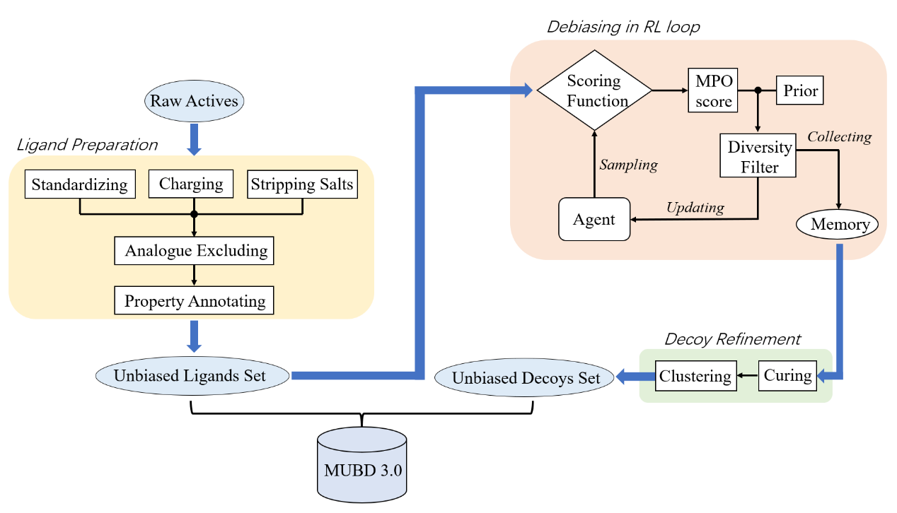

# MUBD-DecoyMaker3.0: Debiasing Maximal Unbiased Benchmarking Data Sets with Deep Reinforcement Learning

## Introduction

MUBD-DecoyMaker3.0 is a brand new generation of MUBD-DECOYMAKER while its core algorithms are derived from [MUBD-DecoyMaker2.0](https://github.com/jwxia2014/MUBD-DecoyMaker2.0). Compared with past versions of MUBD-DECOYMAKER, MUBD-DecoyMaker3.0 has two major features:
* Virtual molecules constitue the unbiased decoy set (UDS) which are generated by recurrent neural netwrok (RNN)-based molecular generator with reinforcement learning (RL).
* Decoy filtering algorithms of MUBD-DECOYMAKER are designed as the scoring function for RL to fine tune the generator.

This open source repository provides the implementation of MUBD-DecoyMaker3.0.



## Requirements

MUBD-DecoyMaker3.0 employs [REINVENT](https://github.com/MolecularAI/Reinvent) to generate virtual decoys. We recommend users to install this tool as instructed. This `conda` environment called `reinvent.v3.2` is used for decoy generation. We have modified the distributed packages `reinvent_chemistry` and `reinvent_scoring` to add scoring functions for MUBD:
1) Clone this repository and navigate to it.
2) Merge modifications to original `reinvent_chemistry` and `reinevnt_scoring` :
```
$ cp -r reinvent_chemistry/ reinvent_scoring/ ~/anaconda3/envs/reinvent.v3.2/lib/python3.7/site-packages
```
Another `conda` environment called `MUBD3.0` is created for pre-post-processing: 
```
$ conda env create -f MUBD3.0.yml
```

## Usage

The test case of ACM Agonists is employed to illustrate the usage of MUBD-DecoyMaker3.0. All source files can be found in `resources`. 

### Get unbiased ligand set (ULS)
Run `get_ligands.py` to process the raw ligand set. This script takes raw ligands in the representation of SMILES `raw_actives.smi` as input and outputs unbiased ligand set `Diverse_ligands.csv`. Another four property profiles `Diverse_ligands_PS.csv`, `Diverse_ligands_PS_maxmin.csv`, `Diverse_ligands_sims_maxmin.txt` and `Diverse_ligands_len.txt` are also recorded. Please use the `--cure` option to preprocess the SMILES if no curation is performed before.
```
$ conda activate MUBD3.0
(MUBD3.0) $ python get_ligands.py
```

### Generate virtual decoys

`mk_config.py` writes out the configuration for MUBD3.0 virtual decoy generation. In order to automatically set up the configuration for each ligand and proceed to the next ligand, we provide `gen_decoys.sh`. Please replace the `</path/to/REINVENT>` and `</path/to/MUBD3.0>` in scripts with user defined directories.
```
$ mkdir output
$ chmod +x ./gen_decoys.sh
$ conda activate reinvent.v3.2
(reinvent.v3.2) $ ./gen_decoys.sh
```

### Get unbiased decoy set (UDS)
After decoy generation, each potential decoy set for `ligand_$idx` is stored in `output/ligand_$idx/results/scaffold_memory.csv`. Decoy refinement including SMILES curation and molecular clustering are performed to get unbiased decoy set `Final_decoys.csv`. We provide `process_decoys.sh` to automatically run `agglomerative_clustering.py` and `pool_decoys.py`.
```
$ chmod +x ./process_decoys.sh
$ conda activate MUBD3.0
(MUBD3.0) $ ./process_decoys.sh
```

## Validation
Basic validation is conducted based on four metrics. Please go through the notebook `basic_validation.ipynb` for more details.
```
$ conda activate MUBD3.0
(MUBD3.0) $ jupyter notebook